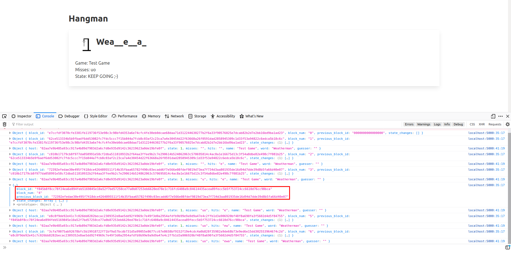

# Hangman

## Synopsis

This repository contains an implementation of [Hangman](https://en.wikipedia.org/wiki/Hangman_(game)) based on top of the [Sawtooth Distributed Ledger](https://www.hyperledger.org/projects/sawtooth) to showcase the technology. I was inspired by the [Tic-Tac-Toe example](https://github.com/hyperledger/sawtooth-sdk-python/tree/master/examples/xo_python) from the Sawtooth repository. This is meant to be a proof of concept so it's by far not feature complete.

## Design Decisions

To showcase different aspects of Sawtooth I opted to split the implementation into three pieces/containers:
- `hangman-tp-py`: _Hangman Transaction Processor in Python_ - This is the actual business logic for the Hangman application. It implements a `hm` transaction family and provides definitions for the state and payload. The transactions defined in here operate on the distributed ledger.
- `hangman-cli-py`: _Hangman CLI in Python_ - The command-line interface can be used to submit messages to the Sawtooth network.
- `hangman-web-py`: _Hangman Web Interface in Python_ - The last component showcases how to subscribe to events to the Sawtooth network via [ZeroMQ](https://zeromq.org/).

### Hangman State

The state of a Hangman `Game` comprises the following attributes:
 - `name` - The name of the game, e.g. `My test game`
 - `word` - The word to be guessed, e.g. `Weatherman`
 - `misses` - Letters which have been guessed but weren't successful, e.g. `iou`
 - `hits` - Letters which have been guessed and were successful, e.g. `ae`
 - `host` - The player hosting the game, i.e. the player who created the game and defined the word
 - `guesser` - The player guessing
 - `state` - The current state, one of:
   - `GAME_STATE_ONGOING`
   - `GAME_STATE_WON`
   - `GAME_STATE_LOST`

### Hangman Payload & Actions

The payload of a message has the following attributes: `name`, `action` and `guess`
- `name` - The name of the game
- `action` - Can be either `create`, `delete` or `guess`
- `guess` - Contains the letter to be guessed in case `guess` was selected as `action`

## Contents

This repository contains roughly the following files:

```
├── docker-compose.yaml <- Controls starting/stopping the containers
├── hangman-cli-py
│   ├── code
│   │   ├── hmascii.py
│   │   ├── hmcli.py <- CLI application
│   │   └── __init__.py
│   ├── Dockerfile
│   └── requirements.txt
├── hangman-tp-py
│   ├── code
│   │   ├── handler.py <- Handles create, delete and guess actions
│   │   ├── __init__.py
│   │   ├── main.py <- Main file which registers the handler and starts the `TransactionProcessor`
│   │   ├── payload.py <- Describes `HmPayload`
│   │   └── state.py <- Describes `HmState` and `Game`
│   ├── Dockerfile
│   └── requirements.txt
├── hangman-web-py
│   ├── code
│   │   ├── main.py <- Main file which starts the Flask app.
│   │   ├── static <- Static files used in conjunction with the template.
│   │   │   ├── ...
│   │   │   ├── bulma.min.css
│   │   │   └── cbor.js
│   │   └── templates
│   │       └── index.html <- Main template.
│   ├── Dockerfile
│   └── requirements.txt
├── ...
└── README.md <- The file you're reading
```

I'm following [PEP8](https://www.python.org/dev/peps/pep-0008/) and the [Google Python Style Guide](http://google.github.io/styleguide/pyguide.html) throughout the code.

## Usage

This assumes you have [Git](https://git-scm.com/), [Docker](https://www.docker.com/) and [Docker Compose](https://docs.docker.com/compose/) installed.

- Clone the repository: `git clone <repository URL>`
- Change into the directory: `cd sawtooth-hangman`
- Bring up the containers: `docker-compose up` (or `docker-compose up -d` for detached mode)
- Check if the containers are powered up correctly: `docker ps --format "{{.ID}}\t{{.Image}}\t{{.Status}}"`, this should give something similar like:
```
2298221d6c1c	hyperledger/sawtooth-shell:chime		Up 37 seconds
3ef6c78e4ed6	hyperledger/sawtooth-devmode-engine-rust:chime	Up 40 seconds
f8b2fea50621	hyperledger/sawtooth-rest-api:chime		Up 39 seconds
3dc181fa34c6	sawtoothhangman_hangman-web-py			Up 42 seconds
214d921834b3	hyperledger/sawtooth-settings-tp:chime		Up 44 seconds
f49dee7053ef	sawtoothhangman_hangman-tp-py			Up 41 seconds
e544d1633ace	sawtoothhangman_hangman-client-py		Up 43 seconds
8a123aa4e026	hyperledger/sawtooth-validator:chime		Up 45 seconds
```
- Don't forget to power down the containers correctly with: `docker-compose down`

### CLI

- Connect to the container: `docker exec -it hangman-cli-py /bin/bash`
- Start the interactive CLI: `./code/hmcli.py`


### Web Interface

Point your browser to: `http://localhost:5000/`

You'll see something like this:


- The view updates automatically as events are being received by Sawtooth.
- By default only one game will be displayed, whatever last move was done in whatever last game will be displayed.
- The console logs the data which was received, complete with previous block information., ...
- ...as well as the current decoded state of the game.

## Links
- [Hyperledger Sawtooth Python SDK](https://github.com/hyperledger/sawtooth-sdk-python/)
- [Core repository for Sawtooth Distributed Ledger](https://github.com/hyperledger/sawtooth-core)
- [Sawtooth Documentation](https://sawtooth.hyperledger.org/docs/core/releases/latest/contents.html)
- [Endpoint Specifications](https://sawtooth.hyperledger.org/docs/core/releases/latest/rest_api/endpoint_specs.html)

## Disclaimer

Please note, due to time constraints while creating this proof of concept I wasn't able to follow several best practices in software engineering I'd otherwise follow.
- No tests - I was focusing on the proof of concept and showcasing the technology so no tests are provided.
- Limited tooling - Developing and debugging is not easy as I didn't focus on setting up or optimizing the tooling.
- Limited documentation - I tried to note down the main thought process but this is far from complete and what I'd usually consider good documentation.

## To-Do List

- Add tests
- Remove volume declarations from `docker-compose.yaml`
- Don't use random private keys, let the user supply their own public/private keys (e.g. via an environment variable or command line parameter)
- Implement correct `host`/`guesser` handling, right now everyone can make a guess ;-)